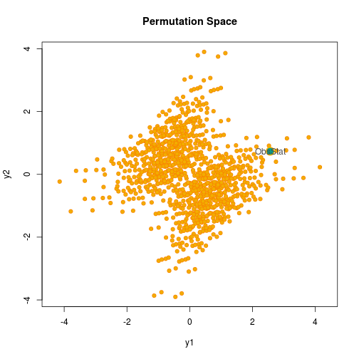

<a href="https://github.com/livioivil">more @ Github</a>

Bugs are always possible, I make my best to provide a new release averytime I found them.
Please report bugs to: 'livio.finos@unipd.it'. Peculiarities, feedback and general queries on the use and theory of the software are also welcomed.

#Packages for **Permutation tests** (and conditional resampling)

## flip
A R package for multivariate permutation tests.

<a class="mceItemAnchor" title="flip" href="http://cran.r-project.org/web/packages/flip" target="_blank" mce_real_href="http://cran.r-project.org/web/packages/flip">on CRAN</a>

 <a mce_real_href="https://github.com/livioivil/flip" href="https://github.com/livioivil/flip">The github dev version can be found here</a>.
 

## R examples
<a class="mceItemAnchor" title="flip_extra" href="https://rawgit.com/livioivil/flip_extra/master/README.html" target="_blank" mce_real_href="https://rawgit.com/livioivil/flip_extra/master/README.html">web material with some example</a>

## flipscore
<a class="mceItemAnchor" title="flipscore" href="http://cran.r-project.org/web/packages/flipscore" target="_blank" mce_real_href="http://cran.r-project.org/web/packages/flipscore">**flipscore**</a>
A R package for robust score test with permutation tests.

&nbsp;

## NPClib (MATLAB)
<a href="http://www.wiley.com/legacy/wileychi/pesarin/material.html" mce_real_href="http://www.wiley.com/legacy/wileychi/pesarin/material.html">NPClib (MATLAB) </a>

<b>DESCRIPTION</b>: NPClib is the acronyms of "NonParametric Combination library", the guiding principle underlying this software package. It is a library of MATLAB functions and it allows for a fully univariate and multivariate permutation-based inference. Most of the methods are formally stated in Pesarin, F. (2001) Multivariate Permutation Test with Application in Biostatistics. Wiley, New York. Other can be found in   
Pesarin and Salmaso (2010)*Permutation Tests for Complex Data - Theory, Applications and Software*, Wiley Series in Probability and Statistics.

# Pacakges for Multiple Testing

## ARIbrain: All Resolution Inference for fMRI data 
<a class="mceItemAnchor" title="ARIbrain" href="http://cran.r-project.org/web/packages/ARIbrain/" target="_blank" mce_real_href="http://cran.r-project.org/web/packages/ARIbrain/">ARIbrain</a>

## R package <a class="mceItemAnchor" title="someMTP" href="http://cran.r-project.org/web/packages/someMTP/" target="_blank" mce_real_href="http://cran.r-project.org/web/packages/someMTP/">someMTP</a>

It's a (small) collection of functions for Multiplicty Correction and Multiple Testing. Among others, you can find functions from some of my work 

<b>lsd.test() DESCRIPTION</b>: It performs test on multivariate-multiple linear models (i.e. many predictors and predicted) with covariates (i.e. not under test). It also allows to deal with datasets having more dependent variables than observations (negative df).  

See&nbsp;&nbsp; L. Finos (2011). A note on Left-Spherically Distributed Test with covariates, Statistics and Probabilty Letters, accepted. 

<b>step.adj() DESCRIPTION</b>: This function corrects the false discoveries (weak familywise control) due to model selection. It works with models of class glm and selected with function step() of library stats.

See&nbsp;&nbsp; L. Finos, C. Brombin, L. Salmaso (2009). Adjusting stepwise p-values in generalized linear models. Communications in Statistics - Theory and Methods. Accepted.

and L. Finos, C. Brombin, L. Salmaso (2007). Adjusting p-values of a stepwise generalized linear model. MCP 2007 Vienna, Austria. July 8-11, 2007. <a href="http://www.mcp-conference.org/2007/presentations/Brombin_Chiara.pdf" target="_blank" mce_real_href="http://www.mcp-conference.org/2007/presentations/Brombin_Chiara.pdf">slides</a>

C. Brombin, L. Finos, R. Arboretti Giancristofaro (2007). How confident can you be in stepwise-glm findings? First IBS Channel Network meeting, Rolduc, May 8-11, 2007. 

 

<b>p.adjust.w() DESCRIPTION</b>: Given a set of p-values, returns p-values adjusted using one of several (weighted) methods. It extends the method of p.adjust of library stats. 

See&nbsp;&nbsp; L. Finos, L. Salmaso (2007). FDR- and FWE-controlling methods using data-driven weights. Journal of Statistical Planning and Inference, 137,12, 3859-3870. ISSN: 0378-3758. See also the related <a href="http://homes.stat.unipd.it/livio/?page=Research#weights" target="_blank" mce_real_href="http://homes.stat.unipd.it/livio/?page=Research#weights">research page</a><a href="http://homes.stat.unipd.it/livio/?page=Research#weights" target="_blank" mce_real_href="http://homes.stat.unipd.it/livio/?page=Research#weights"> </a>

## Other packages
#### R package <a onclick="return true;window.open('','','');" href="http://cran.r-project.org/web/packages/someKfwer/index.html" target="_blank" mce_real_href="http://cran.r-project.org/web/packages/someKfwer/index.html">someKfwer</a>

<b>DESCRIPTION</b>: This library collects some procedures controlling the Generalized Familywise Error Rate: kfwe.ord ordinal, Lehamn and Romano, Guo and Romano (Single Step and Step Down) procedures. 

More datails <a href="http://homes.stat.unipd.it/livio/?page=Research#kfweord" target="_blank" mce_real_href="http://homes.stat.unipd.it/livio/?page=Research#kfweord">here</a>

<b>AUTHORS:</b>&nbsp; Livio Finos and Alessio Farcomeni 

<i> </i>

&nbsp;

#### (coauthor of) functions <i>inheritance</i> and <i>covariates</i> in 
R package <a href="http://bioconductor.org/packages/2.5/bioc/html/globaltest.html" target="_blank" mce_real_href="http://bioconductor.org/packages/2.5/bioc/html/globaltest.html">globaltest</a>  

<b>DESCRIPTION:</b> The global test is a locally most powerful test against potentially high-dimensional alternatives. This package implements this test for (generalized linear) regression models, and has several functions to facilitate the use of this test for gene set testing of GO and KEGG terms.

<b>AUTHORS:</b>&nbsp; Jelle Goeman, Jan Oosting 

<i> </i>

&nbsp;

&nbsp;

&nbsp;

#### <a href="http://associazionerospo.org/livio/MTHw.zip" mce_real_href="http://associazionerospo.org/livio/MTHw.zip">MTHw (MATLAB)</a>

<b>DESCRIPTION</b>: MTHw perform Multiple Hypotheses Testing (FWE and FDR) procedures with weights as described in: Benjamini,Y., Hochberg,Y., 1997. Multiple hypotheses testing with weights. Scand. J. Statist. 24, 407-418. 

The weights must usually be chosen a priori, on the basis of experimental hypotheses. Under some conditions, however, they can be chosen making use of information from the data (therefore a posteriori) while maintaining multiplicity control. 

More datails <a href="http://homes.stat.unipd.it/livio/?page=Research#weights" mce_real_href="http://homes.stat.unipd.it/livio/?page=Research#weights">here</a> 

<b>FILES</b>: FDRw.m, BHw.m, HOMw.m 

# Text mining and social network
## R package for Text Mining: <a class="mceItemAnchor" title="TextWiller" href="https://github.com/livioivil/TextWiller" target="_blank" mce_real_href="https://github.com/livioivil/TextWiller">TextWiller</a>

A collaborative project on text mining, specially devoted to the italian language.

The library is the result of the work of many people, 
Author: (associazionerospo.org) Dario Solari, Andrea Sciandra, Marco Rinaldo, Matteo Redaelli, Livio Finos, with the contribution of Marco Rinaldo, Maddalena Branca, Federico Ferraccioli.

TextWiller is on github: <a mce_real_href="https://github.com/livioivil/TextWiller" href="https://github.com/livioivil/TextWiller">https://github.com/livioivil/TextWiller</a>. Therefore, to install it just type:

<pre style="font-family: Consolas, 'Liberation Mono', Courier, monospace; font-size: 12px; margin-top: 0px; margin-bottom: 0px; color: rgb(51, 51, 51); font-style: normal; font-variant: normal; font-weight: normal; letter-spacing: normal; line-height: 18px; orphans: auto; text-align: start; text-indent: 0px; text-transform: none; widows: auto; word-spacing: 0px; -webkit-text-stroke-width: 0px;">
#install devtools, if you don't have it: install.packages("devtools")

library(devtools)

install_github("TextWiller", "livioivil")

library(TextWiller)
</pre>

&nbsp;

## R package <a onclick="return true;window.open('','','');" href="http://cran.r-project.org/web/packages/egonet/index.html" target="_blank" mce_real_href="http://cran.r-project.org/web/packages/egonet/index.html">egonet
<a onclick="return true;window.open('','','');" href="http://cran.r-project.org/web/packages/egonet/index.html" target="_blank" mce_real_href="http://cran.r-project.org/web/packages/egonet/index.html"> </a></h3>

<b>DESCRIPTION</b>: A small tool for Social Network Analysis, dealing with ego-centric network measures, including Burt's effective size and aggregate constraint and an import code suitable for a large number of adjacency matrices. 

<b>AUTHORS:</b>&nbsp; A. Sciandra, F. Gioachin, L. Finos

<!-- 
  
 -->

<input id="gwProxy" type="hidden"><!--Session data--><input id="jsProxy" onclick="jsCall();" type="hidden"> 

<input id="gwProxy" type="hidden"><!--Session data--><input id="jsProxy" onclick="jsCall();" type="hidden"> 

<input id="gwProxy" type="hidden"><!--Session data--><input id="jsProxy" onclick="jsCall();" type="hidden"> 

<input id="gwProxy" type="hidden"><!--Session data--><input id="jsProxy" onclick="jsCall();" type="hidden"> 

<input id="gwProxy" type="hidden"><!--Session data--><input id="jsProxy" onclick="jsCall();" type="hidden"> 

<input id="gwProxy" type="hidden"><!--Session data--><input id="jsProxy" onclick="jsCall();" type="hidden"> 

